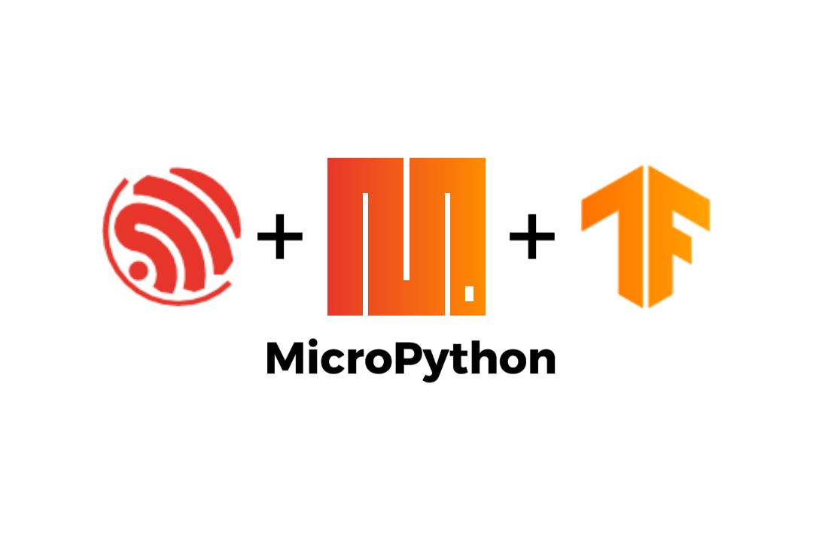

# tflite-micropython-esp
Based on [tensorflow-micropython-examples](https://github.com/mocleiri/tensorflow-micropython-examples)
[]()

## Implementing:
The repo's structure is designed to be easily implemented.


We have two possible cmakes to use:
- src/base.cmake (Includes only tflite micro)
- src/full.cmake (Includes additional libraries like ulab)

## Building for ESP-IDF 5.4

A helper script `scripts/build_and_check.sh` can be used to build the firmware for a given board using ESP-IDF 5.4.  The script follows the same steps as the GitHub workflow and will fetch the required ESP-IDF release if missing.

```bash
# Build firmware for the default MICROLITE board
./scripts/build_and_check.sh

# Or specify a board
./scripts/build_and_check.sh MICROLITE_S3
```

The script expects the submodules to be accessible over the network in order to fetch Micropython and related dependencies.
