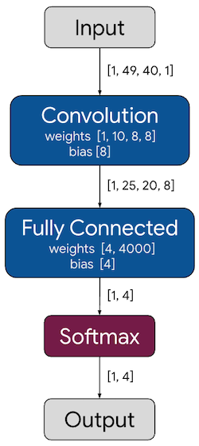

# Tensorflow Lite for Microcontrollers Micro Speech Example

The micro-speech example runs an example trained on the [Speech Commands Version 2 Dataset](https://www.tensorflow.org/datasets/catalog/speech_commands).

Scores above 200 are considered a match.

# Model Architecture

It has been trained to detect four possible classes of output, each with a score:

| Index | Category |
| --- |----------|
| 0 | Silence  |
| 1 | Unknown |
| 2 | Yes |
| 3 | No | 

scores over 200 are considered a match.

# Audio Preprocessing

The microlite.audio_frontend type wraps the tensorflow lite experimental audio frontend which is used to create
the spectogram data.

The spectrogram data is what is fed into the input layer of the machine learning model.

# Additional Classes

The micro_speech.py file is a micropython script that handles some of the tasks that were done in c++ in the upstream
example.  

The **FeatureData** class holds 49 **Slices**.  Each slice is 30ms of the last second of audio that has been
converted into a spectrogram.

The  FeatureData.segmentAudio takes an audio buffer and cuts it up into slices.

When inferences runs several times a second it copies the spectrogram data for those 49 slices into the input 
tensor.

Just like in the C++ reference implementation we only replace as many slices as are covered by the length of the audio 
buffer passed in.

We are not repeatedly converting the 49 slices from audio to spectrogram; at any time we only create the new slices and 
then use that plus the previously converted data to feed the input tensor.

In main.py the **Results** class is used to keep score for the previously matched values.   The upstream example
expects several inferences per second and reports a match if the last few matches have an averrage score over 200 in one 
category (yes, no, silence, unknown).

The micropython implementation is able to work when we find a single score over 200.  In which case we throw away the 
FeatureData slices and start frmo scratch again.

The output tensor has 4 values which rank its prediction of the four classes:

| Index | Category |
| --- |----------|
| 0 | Silence  |
| 1 | Unknown |
| 2 | Yes |
| 3 | No | 

# Working Examples

[ESP32](esp32/README.md),  [RP2040](rp2/README.md).

# Tensorflow Micro C++ Micro_Speech Example

This is the [tflite-micro c++ micro_speech example](https://github.com/tensorflow/tflite-micro/blob/main/tensorflow/lite/micro/examples/micro_speech/README.md) in tensorflow micro

